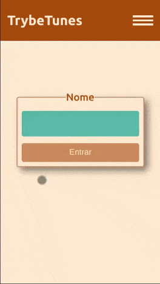

# Português 🇧🇷🇵🇹

<details>
  <summary>
    Saiba mais
  </summary>
  
  # TrybeTunes
Projeto da [Trybe](https://www.betrybe.com/) - Bloco 12 - Aplicação de streaming de música feito em React, utilizando métodos do ciclo de vida de componentes e React Router.

## 💻 Projeto

Aplicação de streaming de música com diversas funcionalidades, como:

- Fazer login;
- Pesquisar por uma banda ou artista;
- Listar os álbuns disponíveis dessa banda ou artista;
- Visualizar e reproduzir uma prévia das músicas de um álbum selecionado;
- Favoritar e desfavoritar músicas;
- Ver a lista de músicas favoritas;
- Ver e editar o perfil da pessoa logada.


<details>
  <summary><strong>🏆 Meu desempenho</strong></summary><br />

  
</details>
  
<details>
  <summary><strong>🖼️ Gif do projeto</strong></summary><br />

  <div>
    
  </div>
  <div>
    
  </div>
</details>

## 🚀 Tecnologias
> Este projeto foi desenvolvido com:

- JavaScript
- React
- React Router

## 📌 Habilidades
> Habilidades desenvolvidas:

- Fazer requisições e consumir dados vindos de uma API;
- Utilizar os ciclos de vida de um componente React;
- Criar rotas com o React Router, utilizando os componentes BrowserRouter, Switch, Route, Redirect e Link;
- Utilizar a função setState de forma a garantir que um determinado código só seja executado após o estado ser atualizado.

## ⬇️ Instalando dependências

```bash
npm install
``` 

## ⚡ Executando a aplicação

```bash
npm start
```

## Time de desenvolvimento
> Projeto individual:
  

## 💬 Contatos

<div align="center" style="display: inline_block">
  <a href="https://rabeloguedes.github.io" target="_blank">
    
  </a> 
  <a href="https://www.linkedin.com/in/al%C3%AA-emmanuel-rabelo-guedes/" target="_blank">
    
  </a> 
   <a href="mailto:rabeloguedes@proton.me">
     
  </a>
</div>

</details>

# English 🇺🇸🇬🇧

<details>
  <summary>
    More
  </summary>
  
  # TrybeTunes
Project from [Trybe](https://www.betrybe.com/) - Block 12 - React application that streams music made in React, using the lifecycle methods of components and React Router.

## 💻 Project

Streaming music with various functionalities, such as:

- Login;
- Search for a band or artist;
- List the albums available from this band or artist;
- Preview and play a preview of the songs of an album selected;
- Favorite and unfavorite songs;
- See the list of favorite songs;
- See and edit the profile of the logged in person.

<details>
  <summary><strong>🏆 My accomplishment</strong></summary><br />

  
</details>
  
<details>
  <summary><strong>🖼️ Project's Gif</strong></summary><br />

   <div>
    
  </div>
  <div>
    
  </div>
</details>

## 🚀 Technologies
> This project was developed with:

- JavaScript
- React
- React Router

## 📌 Skills
> Practiced skills:

- Make requests and consume data from an API;
- Use the lifecycle methods of a React component;
- Create routes with the React Router, using the components BrowserRouter, Switch, Route, Redirect and Link;
- Use the setState function to guarantee that a certain code is only executed after the state is updated.
  
## ⬇️ Install dependencies

```bash
npm install
``` 

## ⚡ Execute the application

```bash
npm start
```
## Squad
> Single Person Project:
  

## 💬 Contact

<div align="center" style="display: inline_block">
  <a href="https://rabeloguedes.github.io" target="_blank">
    
  </a> 
  <a href="https://www.linkedin.com/in/al%C3%AA-emmanuel-rabelo-guedes/" target="_blank">
    
  </a> 
   <a href="mailto:rabeloguedes@proton.me">
     
  </a>
</div>

</details>

# Deutsch 🇩🇪

<details>
  <summary>
    Mehr
  </summary>
  
  # TrybeTunes
Projekt von [Trybe](https://www.betrybe.com/) - Block 12 - React-Applikation, die Musik in React streamt, die mit den Lebenszyklus-Methoden von Komponenten und React Router entwickelt wurde.  

## 💻 Projekt

Musik Streaming mit verschiedenen Funktionalitäten, wie:

- Login;
- Suche nach einer Band oder Künstler;
- Liste die Alben verfügbar von dieser Band oder Künstler;
- Vorschau und Abspielen der Lieder eines Albums ausgewählt;
- Favorisieren und unfavorisieren Lieder;
- Sehen Sie die Liste der Favoriten Lieder;
- Sehen Sie und bearbeiten Sie das Profil der eingeloggten Person.

<details>
  <summary><strong>🏆 Meine Leistung</strong></summary><br />
  
</details>
  
<details>
  <summary><strong>🖼️ Projekts Gif</strong></summary><br />

  <div>
    
  </div>
  <div>
    
  </div>
</details>

## 🚀 Technologies
> Dieses Projekt wurde mit den entsprechenden Technologies hergestellt:

- JavaScript
- React
- React Router

## 📌 Fähigkeiten
> Ausgeübte Fähigkeiten:

- Anfragen und Daten von einer API;
- Verwendung der Lebenszyklus-Methoden von Komponenten und React Router;
- Erstellen von Routen mit der React Router, mit Hilfe der BrowserRouter, Switch, Route, Redirect und Link;
- Verwendung der setState-Funktion, um sicherzustellen, dass ein bestimmter Code nur ausgeführt wird, nachdem der Status aktualisiert wurde.

## ⬇️ Installationsanweisungen

```bash
npm install
``` 

## ⚡ Starten der Anwendung

```bash
npm start
```
  
## Entwickungsteam
> Einer Person Projekt:
  

## 💬 Kontakt

<div align="center" style="display: inline_block">
  <a href="https://rabeloguedes.github.io" target="_blank">
    
  </a> 
  <a href="https://www.linkedin.com/in/al%C3%AA-emmanuel-rabelo-guedes/" target="_blank">
    
  </a> 
   <a href="mailto:rabeloguedes@proton.me">
     
  </a>
</div>

</details>
